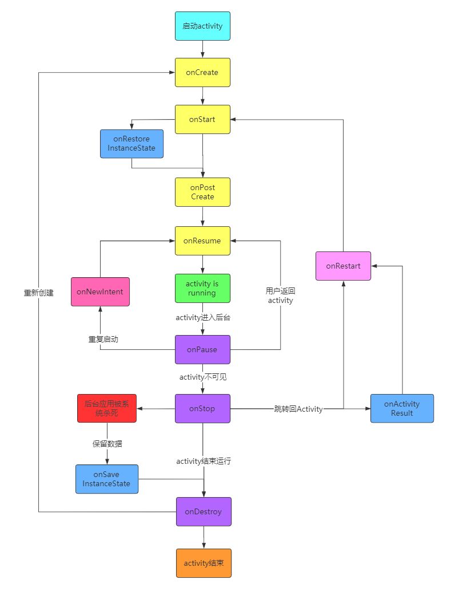
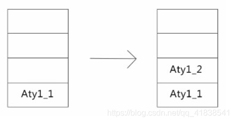
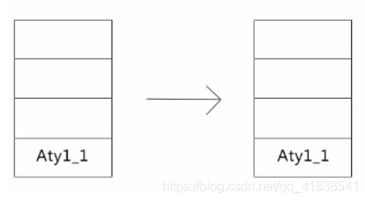
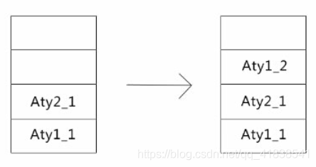
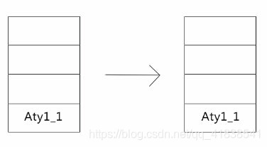
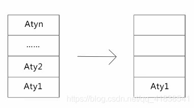
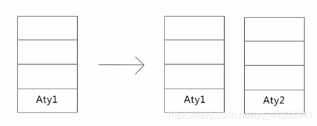
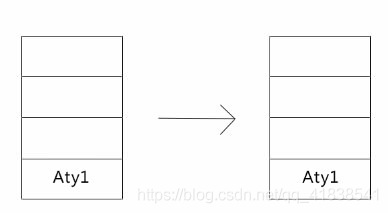
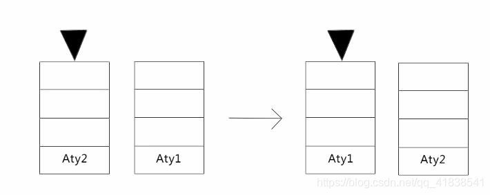

## Activity 详情

<br/>

### Activity是Android组件中最基本也是最为常见用的四大组件之一。Android四大组件有Activity，Service服务，Content Provider内容提供，BroadcastReceiver广播接收器。

### Activity是一个应用程序组件，提供一个屏幕，用户可以用来交互为了完成某项任务。

### Activity中所有操作都与用户密切相关，是一个负责与用户交互的组件，可以通过setContentView(View)来显示指定控件。

### 在一个android应用中，一个Activity通常就是一个单独的屏幕，它上面可以显示一些控件也可以监听并处理用户的事件做出响应。Activity之间通过Intent进行通信。

<br/>

<br/>

## Activity 生命周期

<br/>

#### Activity 的生命周期中包含了5中状态，涉及了7种方法.生命周期指的是一个Activity从创建到销毁的全过程。

### 生命周期的五个状态：

- #### 启动状态：启动状态很短，启动后便会进入运行状态。
- #### 运行状态：Activity在运行状态时处于屏幕的最前端，它是可见的有焦点的，可以与用户进行交互。当Activity处于运行状态时，Android会尽可能地保持它的运行，即使出现内存不足时，Android也会先销毁栈底的Activity来确保当前的Activity正常运行。
- #### 暂停状态：某些情况下，Activity对用户来说仍然可见，但它无法获得焦点。对用户的操作也没有响应此时它就处于暂停状态。例如当前Activity被覆盖了一个透明或者非全屏的Activity时，被覆盖的Activity就处于暂停状态。
- #### 停止状态：Activaty完全不可见时，他就处于停止状态，但仍保留着当前状态的和成员的信息，如果系统内存资源不足，那么这类状态很容易被销毁。
- #### 销毁状态：当Activity位于此状态时，Activity会被清理出内存。

<br/>

### 生命周期模型



- #### onCreate：当Activity创建实例完成，并调用attach方法赋值PhoneWindow、ContextImpl等属性之后，调用此方法。该方法在整个Activity生命周期内只会调用一次。调用该方法后Activity进入ON_CREATE状态。

```java
该方法是我们使用最频繁的一个回调方法。

我们需要在这个方法中初始化基础组件和视图。如viewmodel，textview。
同时必须在该方法中调用setContentView来给activity设置布局。

这个方法接收一个参数，该参数保留之前状态的数据。如果是第一次启动，则该参数为空。
该参数来自onSaveInstanceState存储的数据。
只有当activity暂时销毁并且预期一定会被重新创建的时候才会被回调，如屏幕旋转、后台应用被销毁等

```

- #### onStart：当Activity准备进入前台时会调用此方法。调用后Activity会进入ON_START状态。

```java
要注意理解这里的前台的意思并不意味着Activity可见，只是表示activity处于活跃状态。这也是谷歌文档里让我比较迷惑的地方之一。

前台activity一般只有一个，所以这也意味着其他的activity都进入后台了。
这里的前后台需要结合activity返回栈来理解，后续笔者再写一篇关于返回栈的。

这个方法一般用于从别的activity切回来本activity的时候调用。
```

- #### onResume：当Activity准备与用户交互的时候调用。调用之后Activity进入ON_RESUME状态。

```java
注意，这个方法一直被认为是activity一定可见，且准备好与用户交互的状态。但事实并不一直是这样。如果在onReume方法中弹出popupWindow你会收获一个异常：token is null，表示界面尚没有被添加到屏幕上。

但是，这种情况只出现在第一次启动activity的时候。当activity启动后decorview就已经拥有token了，再次在onReume方法中弹出popupWindow就不会出现问题了。

因此，在onResume调用的时候activity是否可见要区分是否是第一次创建activity。

onStart方法是后台与前台的区分，而这个方法是是否可交互的区分。使用场景最多是在当弹出别的activity的窗口时，原activity就会进入ON_PAUSE状态，但是仍然可见；当再次回到原activity的时候，就会回调onResume方法了。

```

- #### onPause：当前activity窗口失去焦点的时候，会调用此方法。调用后activity进入ON_PAUSE状态，并进入后台。

```java
这个方法一般在另一个activity要进入前台前被调用。只有当前activity进入后台，其他的activity才能进入前台。
所以，该方法不能做重量级的操作，不然则会引用界面切换卡顿。

一般的使用场景为界面进入后台时的轻量级资源释放。

最好理解这个状态就是弹出另一个activity的窗口的时候。
因为前台activity只能有一个，所以当前可交互的activity变成另一个activity后，
原activity就必须调用onPause方法进入ON_PAUSE状态；但是！！仍然是可见的，只是无法进行交互。
这里也可以更好地体会前台可交互与可见性的区别。

```

- #### onStop：当activity不可见的时候进行调用。调用后activity进入ON_STOP状态。

```java
这里的不可见是严谨意义上的不可见。

当activity不可交互时会回调onPause方法并进入ON_PAUSE状态。
但如果进入的是另一个全屏的activity而不是小窗口，那么当新的activity界面显示出来的时候，
原Activity才会进入ON_STOP状态，并回调onStop方法。
同时，activity第一创建的时候，界面是在onResume方法之后才显示出来，
所以onStop方法会在新activity的onResume方法回调之后再被回调。

注意，被启动的activity并不会等待onStop执行完毕之后再显示。
因而如果onStop方法里做一些比较耗时的操作也不会导致被启动的activity启动延迟。

onStop方法的目的就是做资源释放操作。
因为是在另一个activity显示之后再被回调，
所以这里可以做一些相对重量级的资源释放操作，如中断网络请求、断开数据库连接、释放相机资源等。

如果一个应用的全部activity都处于ON_STOP状态，那么这个应用是很有可能被系统杀死的。
而如果一个ON_STOP状态的activity被系统回收的话，系统会保留该activity中view的相关信息到bundle中，
下一次恢复的时候，可以在onCreate或者onRestoreInstanceState中进行恢复。

```

- #### onRestart ：当从另一个activity切回到该activity的时候会调用。调用该方法后会立即调用onStart方法，之后activity进入ON_START状态。

```java
这个方法一般在activity从ON_STOP状态被重新启动的时候会调用。
执行该方法后会立即执行onStart方法，然后Activity进入ON_START状态，进入前台。
```

- #### onDestroy：当activity被系统杀死或者调用finish方法之后，会回调该方法。调用该方法之后activity进入ON_DESTROY状态。

```java
这个方法是activity在被销毁前回调的最后一个方法。我们需要在这个方法中释放所有的资源，防止造成内存泄漏问题。

回调该方法后的activity就等待被系统回收了。如果再次打开该activity需要从onCreate开始执行，重新创建activity。

```

- #### onActivityResult

```java
这个方法也很常见，他需要结合startActivityForResult一起使用。

使用的场景是：启动一个activity，并期望在该activity结束的时候返回数据。

当启动的activity结束的时候，返回原activity，原activity就会回调onActivityResult方法了。
该方法执行在其他所有的生命周期方法前。关于onActivityResult如何使用这里就不展开了，我们主要介绍生命周期。

```

- #### onSaveInstanceState/onRestoreInstanceState

```
这两个方法，主要用于在Activity被意外杀死的情况下进行界面数据存储与恢复。什么叫意外杀死呢？

如果你主动点击返回键、调用finish方法、从多任务列表清除后台应用等等，
这些操作表示用户想要完整得退出activity，那么就没有必要保留界面数据了，
所以也不会调用这两个方法。而当应用被系统意外杀死，或者系统配置更改导致的activity销毁，
这个时候当用户返回activity时，期望界面的数据还在，则会通过回调onSaveInstanceState方法来保存界面数据，
而在activity重新创建并运行的时候调用onRestoreInstanceState方法来恢复数据。
事实上，onRestoreInstanceState方法的参数和onCreate方法的参数是一致的，只是他们两个方法回调的时机不同。
因此，判断是否执行的关键因素就是用户是否期望返回该activity时界面数据仍然存在。

这里需要注意几个点：

1.不同android版本下，onSaveInstanceState方法的调用时机是不同的。

2.当activity进入后台的时候，onSaveInstanceState方法则会被调用，
  而不是异常情况下才会调用onSaveInstanceState方法
  ，因为并不确定在后台时，activity是否会被系统杀死，
  所以以最保险的方法，先保存数据。当确实是因为异常情况被杀死时，
  返回activity用户期望界面需要恢复数据，才会调用onRestoreInstanceState来恢复数据。
  但是，activity直接按返回键或者调用finish方法直接结束Activity的时候，
  是不会回调onSaveInstanceState方法，
  因为非常明确下一次返回该activity用户期望的是一个干净界面的新activity。

3.onSaveInstanceState不能做重量级的数据存储。
  onSaveInstanceState存储数据的原理是把数据序列化到磁盘中，如果存储的数据过于庞大，会导致界面卡顿，掉帧等情况出现。

4.正常情况下，每个view都会重写这两个方法，
  当activity的这两个方法被调用的时候，会向上委托window去调用顶层viewGroup的这两个方法；
  而viewGroup会递归调用子view的onSaveInstanceState/onRestoreInstanceState方法，这样所有的view状态就都被恢复了。

```

<br/>

- #### onPostCreate

```java
这个方法其实和onPostResume是一样的，同样的还有onContextChange方法。
这三个方法都是不常用的，这里也点出其中一个来统一讲一下。

onPostCreate方法发生在onRestoreInstanceState之后，
onResume之前，他代表着界面数据已经完全恢复，就差显示出来与用户交互了。在onStart方法被调用时这些操作尚未完成。

onPostResume是在Resume方法被完全执行之后的回调。

onContentChange是在setContentView之后的回调。

这些方法都不常用，仅做了解。如果真的遇到了具体的业务需求，也可以拿出来用一下。

```

<br/>

- #### onNewIntent

```
这个方法涉及到的场景也是重复启动，但是与onRestart方法被调用的场景是不同的。

我们知道activity是有多种启动模式的，其中singleInstance、singleTop、singleTask都保证了在一定情况下的单例状态。
如singleTop，如果我们启动一个正处于栈顶且启动模式为singleTop的activity，
那么他并不会在创建一个activity实例，而是会回调该activity的onNewIntent方法。
该方法接收一个intent参数，该参数就是新的启动Intent实例。

其他的情况如singleTask、singleInstance，
当遇到这种强制单例情况时，都会回调onNewIntent方法。。

```

<br/>

<br/>

### 横竖屏切换时的细节

#### 默认属性下，Avtivity的生命周期会依次调用 onCreate() → onStart() → onResume()方法，而进行横竖屏切换后调用的方法依次是onPause() → onStop() → onDestroy() → onCreate() → onStart() → onResume() ，所以我们可以在此生命周期内进行横竖屏切换时会首先销毁Activity，之后再重建Activity这种模式在开发中会有一定的影响。如果不希望在横竖屏切换时Activity被销毁重建，可以通过configChanges属性进行设置。这样无论怎样切换Ativity都不会被销毁重建。在manifests/AndroidManifest（清单文件）中修改。

```java
<activity android:name=".MainActivity"
          android:configChanges="orientation|keyboardHidden|screenSize">

```

#### 如果希望某一界面一直处于竖屏或则横屏状态不随手机的晃动而改变同样可以在清单文件中通过设置Activity的参数来完成

```java
竖屏：android:screenOrientation="portrait"
横屏：android:screenOrientation="landscape"
```

<br/>

<br/>

## Activity 启动模式

#### Activity是层叠摆放的，每启动一个新的Activity就会覆盖到原Activity之上。如果单击“返回”按钮，最上面的Activity就会被销毁。下面的Activity重新显示，Activity之所以能这样显示，是因为Android系统是通过任务栈方式来管理Activity实例的。

<br/>

### 1.Android中的任务栈

```java
栈是一种先进后出的数据结构，Android任务栈又被称为返回栈，栈中Activity的顺序就是按照他们打开的顺序依次存放的。
通常一个应用程序对应一个任务栈。
默认情况下每一个启动的Activity都会入栈并位于栈顶位置。
用户操作的永远都是栈顶的Activity在栈中的Activity只有入栈和出栈两种操作。
被当前Activity启动时压入，用户单击返回按钮时出栈，而栈中的Activity的位置和循序都不会发生变化。
```

### 2.Activity的四种启动模式

```java
在实际开发中，应根据特定的需求为每个Activity指定适当的启动模式，Activity的启动模式共有4种。
分别是standard、singleTop、singleTask、和singleInstance。
在清单文件AndroidManifest中通过<activity>标签的android:launchModo 属性可以设置启动模式。

```

- #### standard （标准启动）模式
  
  ##### Activity的默认启动模式，每启动一个Activity就会在栈顶创建一个新的实例，在实际开发中，闹钟程序通常使用这种模式。
  
  
  
  ##### 启动时创建的Aty1_1位于栈底，后创建的实例会堆放到栈顶， 当点返回键的时候，便会从栈顶按顺序将实例移除栈。直至栈为空则退回到桌面。
  
  <br/>
- #### singleTop
  
  ##### 在standard模式下每次启动都会创建一个新的实例，即使当前要创建的Activity已经位于栈顶，不能直接复用，这样并不合理。所以提出了singleTop模式，
  
  ##### 该模式要判断启动的Aativity实例是否位于栈顶，如果位于栈顶则直接复用。否则创建新的实例。
  
  ##### 如果此时Aty1的实例在栈顶，此时再创建一个新的Aty1并不会成功。
  
  
  
  ##### 如果Aty_1不在栈顶，此时再创建一个Aty1的实例，会产生一个新的Aty1实例到栈顶。
  
  
  
  ##### 当点返回键的时候，便会从栈顶按顺序将实例移除栈。直至栈为空则退回到桌面。
- #### singleTask
  
  ##### singleTask很好的解决的重复创建栈顶的问题，但是如果Activity没有处于栈顶的位置，则很有可能会创建多个实例，为了让某个Activity在整个应用程序中只有一个实例，则需要借助singleTask来完成。
  
  ##### Activity指定singleTask模式后，每次启动该Activity时，系统会先查找栈中是否存在当前的Activity如果存在则直接使用并将该Activity之上的所有实例全部出栈。否则才会创建一个新的实例。实力开发时浏览器主界面通常使用这种模式。
  
  ##### 如果此时Aty1的实例在栈顶，此时再创建一个新的Aty1并不会成功。
  
  
  
  ##### 如果Aty_1不在栈顶，此时再创建一个Aty1的实例，页面会返回到任务栈中存在的Aty1的实例，并将Aty1上面所有的实例移出栈。
  
  
  
  ##### 当点返回键的时候，便会从栈顶按顺序将实例移除栈。直至栈为空则退回到桌面
  
  <br/>
- #### singleInstance
  
  ##### singleInstance模式时四种启动模式中最特殊的一个，指定为singleInstance模式的Activity会启动一个新任务栈来管理Activity实例，无论从哪个任务栈启动该Activity，带实力在整个Android系统中只有一个，这种模式存在的意义，是为了在不同的程序之间共享一个Activity实例。
  
  ##### Activity采用singleInstance模式启动通常有两种情况
  ```
      ##### 1.要启动的Activity不存在
  
  #####     系统会新创建一个任务栈，然后在创建该Activity实例。
  ```
  
  #####     此时Aty2的实例还未被创建，创建的Aty2的实例时被存放到一个新的任务栈中。
  
  
  
  ##### 2.启动的Activity已存在
  
  ##### 无论当前Activity在那个程序那个任务栈，系统都会把Activity所在的任务栈移动到前台，从而使Activity显示。来电界面通常采用这种模式。
  
  ##### 此时Aty1的实例在栈顶，此时再创建一个新的Aty1并不会成功。
  
  
  
  ##### 此时Aty1的实例已存在且我们在Aty2的页面中创建新的Aty1实例时，则不会创建新的Aty1实例，而是页面跳转到原来任务栈中存在的Aty1的实例，但存放Aty2实例的任务栈仍然存在
  
  
  
  ##### 当点返回键的时候，便会依次销毁相应的任务栈，直至任务栈数为空则退回到系统桌面。

<br/>

## Activity 之间的跳转

<br/>

#### 在Android系统里，应用程序通常都是由多个界面组成的，每一个界面就是一个Activity，在这些界面之间进行跳转时，实际上也就是Activity之间的跳转。Activity之间的跳转需要用到Intent（意图）组件，通过Intent可以开启新的Activity实现界面跳转功能。

#### Intent被称为意图，是程序中各组件进行交互的一种重要方式，它不仅可以指定当前组件要执行的动作，还能再不同的组件之间进行数据的传递。一般用于启动Activity、Service以及发送个广播等。根据开启目标组件的不同，Intent被分为隐式意图和显式意图两种。

- ### 显式意图
  
  #### 显示意图可以直接通过名称来开启指定的目标组件，通过其构造方法Intent（ContextpackgeContext，Class<?>cls）来实现，其中第一个参数表示但分分钱的Activity对象，这里使用this即可。第二个参数Class表示要启动的目标Activity。通过这个方法创建一个Intent对象，然后将该对象传递给Activity的startActivity（Intent intent）方法即可启动目标组件。
  ```java
  Intent intent = new Intent(this,Activity.class);        // 创建Intent对象
  startActivity（intent）;    
  ```
- ### 隐式意图
  
  #### 隐式意图比显式意图来说更为抽象。他并没有明确指明要开启那个目标组件，而是通过指定action和category等属性信息，系统根据这些信息进行分析，然后寻找目标Activity。
  ```java
  Intent intent = new Intent();
  // 设置action动作，该动作要和清单文件中设置的一样。
  intent.setAction("cn.itcast.START_ACTIVITY");
  startActivity(intent);
  ```
  
  #### 上面只是指定了action，并没有指定category，这是因为在目标Activity的清单文件中配置的category是一个默认值，在调用startActivity() 方法时自动将这个categroy添加到Intent中。
  
  #### 但是，上述代码还不能开启指定的Activity还需在目标Activity的清单文件中配置<intent-filter>指定当前Activity能够响应action和category。
  ```xml
  <activity android:name="cn.itcast.Activity">
              <intent-filter>
              <!--设置action属性，需要在代码中所设置的name打开指定的组件-->
                  <action android:name="cn.itcast.START_ACTIVITY"/>
                  <category android:name="android.intent.category.DEFAULT"/>
              </intent-filter>
          </activity>
  ```
  
  #### 在清单文件中，目标组件Activity指定了可以响应的<action> 和<categoty> 信息，只有当action 和 categoty属性与目标组件设置的内容相同时，目标组件才会被开启，注意：每个intent只能指定一个action，却能指定多个categoty。

<br/>

## Activity 关联知识（持续更新）

<br/>

- ## ActivityThread
  
  #### 通过源码可以知道 ActivityThread 其实并非职责单一，它做的事情并不仅仅针对Avtivity，而是整个应用，比如Application的创建过程也在这里，并非每个Activity都对应一个ActivityThread，而是一个ActivityThread管理着整个应用的Activity事务，事实上可以说是整个应用的生命周期；
  
  #### 主线程消息循环（mainLooper）是在ActivityThread#main()方法中启动的，也就是说，其实处理主线程消息并不是在ActivityThread，而是在执行ActivityThread#main()方法的那个线程，这也就不难解释为啥mainLooper不会阻塞UI线程了，因为是执行于不同的线程。
  
  #### Activity的管理工作是在ActivityThread中进行，但是管理过程在Instrumentation中进行的，这个类会接管Activity和Application的生命周期的处理工作。
  
  #### 读完源码后有些东西还是比较颠覆我的理解的，比如这里Application与Activity的关系，Application 是在首次创建 Activity之后才才创建的，并且只创建一次，创建完成后执行Application的onCreate生命周期回调，Application与Activity的区别简单理解就是Context上下文对象不一样，Application不需要展示UI，并且应用全局只有一个，而 Activity 恰好相反。
  
  <br/>

<br/>

- ## ActivityIcon/ActivityLogo
  
  #### Appliction 和 Activity 配置文件里都可以设置应用Icon和Logo，如果同时设置将优先使用Activity的设置。 
