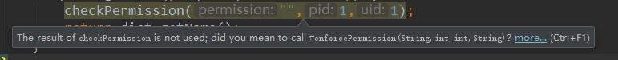

## @Nullable

> 表示可以为 null 的变量、参数或返回值

<br/>

## @NonNull 

> 表示不可为 null 的变量、参数或返回值

<br/>

## @StringRes

> 表示检查是否包含R.string引用

<br/>

## @ColorRes

> 表示检查是否包含R.color引用

<br/>

## @ColorInt

> 表示检查是否包含表示颜色的整型

<br/>

## @DrawableRes

> 表示检查是否包含R.drawable引用

<br/>

## @DimenRes 

> 表示检查是否包含R.dimen引用

<br/>

## @InterpolatorRes 

> 表示检查是否包含插值器引用

<br/>

## @MainThread 

> 表示主线程

<br/>

## @UiThread 

> 表示 UI 线程

<br/>

## @WorkerThread 

> 表示工作线程

<br/>

## @BinderThread 

> 表示Binder线程

<br/>

## @AnyThread 

> 表示任何一个线程

<br/>

## @IntRange 

> 表示可以验证整型参数是否在指定范围内

<br/>

## @FloatRange 

> 表示可以验证浮点型参数是否在指定范围内

<br/>

## @Size 

> 表示可以验证集合、数组、字符串参数是否在指定范围内，可指定最大值、最小值以及确切值

<br/>

## @RequiresPermission 

> 表示可以验证方法调用方的权限，即当使用了权限注解的方法时会检查有没有指定的权限，如果没有则会提示要在 AndroidManifest.xml 文件中申明权限，如果是危险权限还有进行权限动态申请

```java
/**
 * 单个权限检查
 * @param message
 */
@RequiresPermission(Manifest.permission.WRITE_EXTERNAL_STORAGE)
public void setMessage(String message) {
}

/**
 * 全部权限检查
 * @param message
 */
@RequiresPermission(allOf = {
        Manifest.permission.WRITE_EXTERNAL_STORAGE,
        Manifest.permission.READ_EXTERNAL_STORAGE})
public void setMesage(String message) {
}

/**
 * 某个权限检查
 * @param message
 */
@RequiresPermission(anyOf = {
        Manifest.permission.WRITE_EXTERNAL_STORAGE,
        Manifest.permission.READ_EXTERNAL_STORAGE})
public void setMesage(String message) {
}
```

<br/>

## @CallSuper 

> 注解会验证子类的重写方法是否调用父类的实现，这样约束的好处是可保证父类的实现不会修改，当然，如果不使用该注解，子类重写父类的方法可以不调用弗父类的默认实现

<br/>

## @CheckResult 

> 会检查某个方法的返回值是否被使用，如果没有被使用，则会根据 suggest 配置建议使用相同公民没有返回值的另一个方法，如果返回值使用了，则和未加该注解的方法一样

```java
@CheckResult(suggest="#enforcePermission(String,int,int,String)")
public  int checkPermission(@NonNull String permission, int pid, int uid){
    return 0;
}
```

如果没有使用返回值提示如下：



<br/>

## @IntDef

> 可以创建整型的枚举注解来验证其他代码中使用的某些整型，可以保证代码中的某些常量整型是某些具体定义的常量集，注解的位置只能是注解。

<br/>

## @StringDef

> 可以创建字符串的枚举注解来验证其他代码中使用的某些字符串，可以保证代码中的某些常量字符串是某些具体定义的常量集，注解的位置只能是注解。

开发中总会使用到枚举，枚举在一定程度上可使得代码结构更清晰，但枚举的使用会增加内存的开销，这里可以用 Typedef 注解的方式来代替枚举，下面是 Tyoedef 注解的使用，参考如下：

```java
/**
 * Typedef 注解的定义
 */
public class ActionType {

    public static final int ACTION_TYPE_0 = 0;
    public static final int ACTION_TYPE_1 = 1;
    public static final int ACTION_TYPE_2 = 2;

    @Retention(RetentionPolicy.SOURCE)
    @IntDef({ACTION_TYPE_0,ACTION_TYPE_1,ACTION_TYPE_2})
    public @interface ActionTypeDef{

    }
}
```

下面是上述 Typedef 注解的使用方式，参考如下：

```java
/**
 * Typedef注解的使用
 * @param value
 */
private void setValue(@ActionType.ActionTypeDef int value) {
    switch (value) {
        case ActionType.ACTION_TYPE_0:
            break;
        case ActionType.ACTION_TYPE_1:
            break;
        case ActionType.ACTION_TYPE_2:
            break;

//        case 100://不能使用未定义的整型
//            break;
    }
}
```

可见 Typedef 注解约束了使用到的某些整型，当然还可以是字符串，这样也能达到枚举的作用。

<br/>

## @VisibleForTesting

> 表示注解的某个代码块的可见性高于能够测试时需要的水平

<br/>

## @Keep

> 表示被注解的代码块将不会被混淆。

<br/>

## @RequiresApi

> 需要注意的是，该注解仅仅在编辑阶段才有用

```java
@RequiresApi(api = Build.VERSION_CODES.LOLLIPOP)
private void func() {
}

private void call_func1() {
  if(Build.VERSION.SDK_INT >= Build.VERSION_CODES.LOLLIPOP) {
    func();
  }
}

private void call_func2() {
    func();
}
```

### 编译阶段

> 当minSdkVersion比RequiresApi设置的LOLLIPOP低时，这个时候是可以编译通过，只是Android Studio会红色显示call_func2里的func()，提示添加Build.VERSION判断。

### 运行阶段

> 当运行的手机的SDK版本比RequiresApi设置的LOLLIPOP低时。
当调用到call_func2时，func()函数还是会执行，并不因为加了RequiresApi就不执行。
这个和Spring里的注解区别还挺大的，Spring中的类似注解，当判断不符合某种条件时，注解是不会真正调用标记的函数的。
