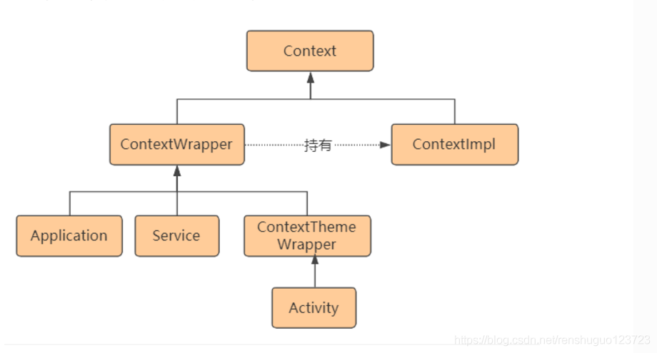
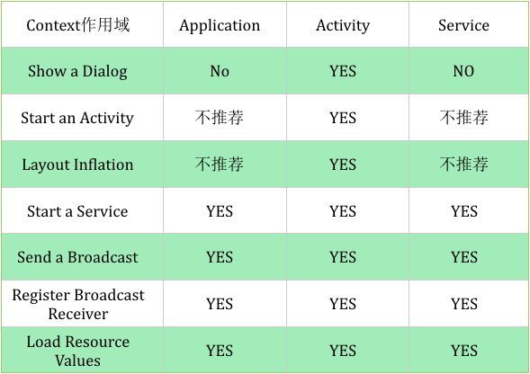

## Context 是什么？

Context是应用和系统进行交互的桥梁，Context本身是抽象类，其内部定义了与系统交互的接口，实现类可以直接Context定义好的接口。

 

## Context 的作用？

四大组件的交互，包括启动Activity,Broadcast,Service,获取ContentResolver等

获取系统/应用资源，包括AssetManager,PackageManager,Resources,SystemService,color,string,drawable等

文件，包括获取缓存文件夹，删除文件，SharePreference相关等

数据库相关，包括打开数据库，删除数据库，获取数据库路径等

其他辅助功能，比如设置ComponetCallbacks,即监听配置信息改变，内存不足等事件的发生

 

## Context 的关系？

## Context 的使用场景

